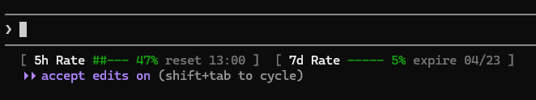

# ShowTokenCost_Pro

Claude Code 하단 상태줄에 rate limit 사용률과 리셋 시간을 표시하는 유틸리티입니다.

## 미리보기



## 표시 정보

| 항목 | 설명 |
|---|---|
| `5h Rate` | 5시간 단위 요청 한도 사용률 / 리셋 시각 (HH:MM) |
| `7d Rate` | 7일 단위 요청 한도 사용률 / 만료 날짜 (MM/DD) |

### 색상 기준

| 색상 | 범위 |
|---|---|
| 초록 | 0 ~ 49% |
| 노랑 | 50 ~ 79% |
| 빨강 | 80% 이상 |

## 설치

루트의 `install.sh`를 실행하면 자동으로 설치됩니다.

```bash
bash install.sh
```

`~/.claude/settings.json`의 `statusLine` 항목에 경로가 자동 등록됩니다. 이후 Claude Code를 재시작하면 적용됩니다.
